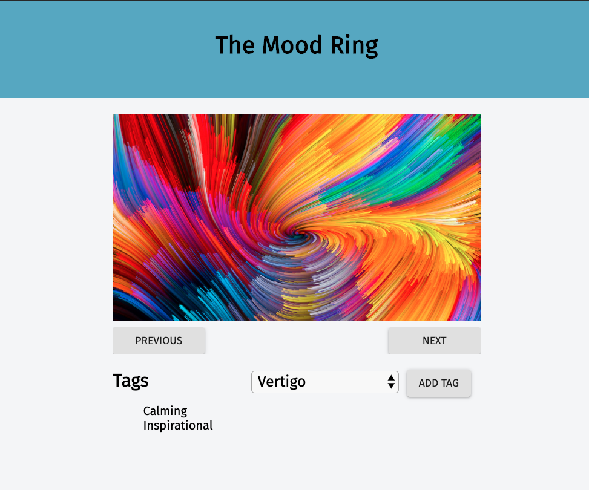

# The Mood Ring

This is an image tagging form. It asks the user to cycle through a carousel of images and apply tags as to how each image makes them feel. The applied tags then get sent to a database to be stored and recalled every time an image is loaded. All of the images paths being displayed are pulled from a database. All of the tags the user can choose from are being pulled from a database. I also added a nice css animation for the image transition.

## Built With
This project uses html/css, React, Redux, and Saga for the front-end and node.js, and express.js as a server and finally postgresql for a database.

## Getting Started
To get this project running you'll have to:
* fork and clone this repo. 
* create a postgresql database using the queries in the 'Database.sql' file (table and inserts only).
star:
- You'll want to run a postrgesql server while using this project
* in the directory you cloned this repo to, you'll need to run `npm install` to get the dependencies installed for this project.
* once you have your database created and running and you've installed all dependencies, you'll have to run your express server. You should be able to do so by running `npm run server`.
* Once your server is running, you can run the project in a browser by running `npm run client`

## Prerequisites
In order to run this project you'll need to install:

* [node.js](https://nodejs.org/en/) 
* [express.js](https://expressjs.com/) 
* [react](https://reactjs.org/) 
* [redux](https://redux.js.org/)
* [saga](https://redux-saga.js.org/)
* [postgres](https://www.postgresql.org/) and 
* [pg](https://node-postgres.com/)
* All of these can also be installed using NPM (this is my preferred method)
* [NPM](https://www.npmjs.com/)

## Installing
* Download this project.
* install prerequisite libraries listed above.
* run `npm install` from project directory in terminal
* run `npm run server` to start your express server
* run `npm run client` to open this project up in a browser

## Screen Shot

## Completed Features
* Developed react components that display on the DOM
* The DOM displays an image and buttons to switch between them.
* The DOM displays the currently applied tags on the current visible image and allows you to select a new tag to add.
* All image paths are stored on a postresql database and are collected when the page loads.
* All the available tags to assign are stored in the database and retrieved on page load/when a new image is selected.
* All applied tags are displayed for the image that is currently visible. These tags are retrieved from the database.

## Author
[Stefen Menzel](https://github.com/stefenmenzel)

